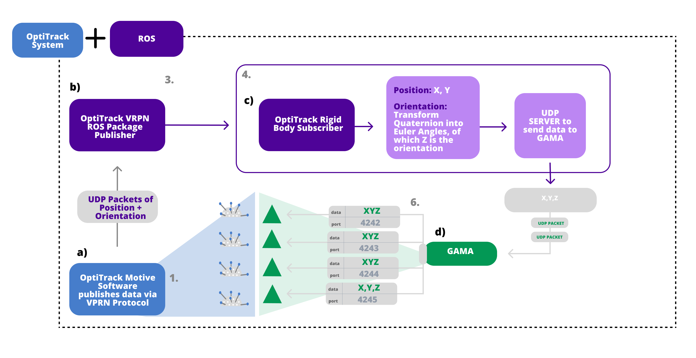
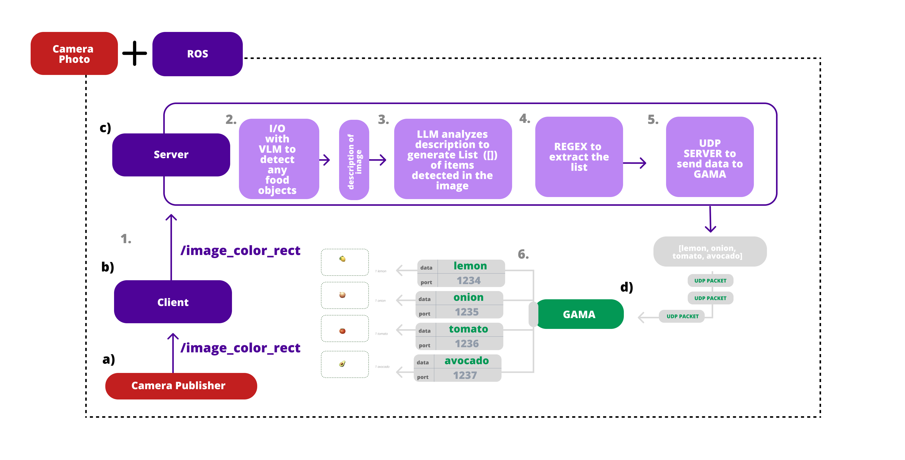

# SPICE: Smart Projector Interface for Cooking Enhancement

The ”Smart Projector Interface for Cooking Enhancement” (SPICE), is a user interface which investigates the integration of Tangible User Interfaces (TUIs) in a kitchen setting, aiming to transform cooking experiences from traditional text-based recipe following to a dynamic, interactive process. 

| Component | Description | Code |
| --- | --- | --- |
| OptiTrack | Tracking system for the tangible objects | [OptiTrack](./components/optitrack_ros_client/) |
| Projection | Projecting the interface on the kitchen surface | [Projection](./components/udp_ros_to_gama_sender/) |
| Vision | User interface for the cooking process | [Interface](./vision/) |
| Audio | Audio feedback for the cooking process | [Audio](./audio/) |

### OptiTrack DataFlow

### Vision DataFlow 

